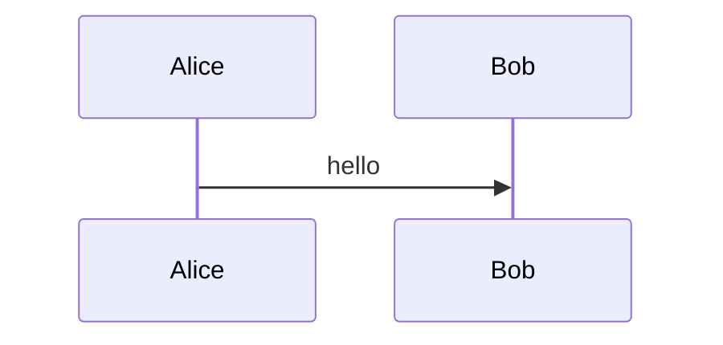

# 飞书 HTML 到 Markdown 转换技术文档

## 1. 文档目标

本文档描述如何将从飞书文档复制出来的 HTML 内容稳定转换为 Markdown，并重点说明飞书特有的结构化数据、文本绘图元素的 JSON 反查路径、各类块级元素的映射规则、边界条件以及后续扩展方向。

本文档面向实现者，默认读者需要直接据此编写或维护转换器，而不是只理解大致思路。

## 2. 背景与问题定义

从飞书文档复制内容时，剪贴板中的 `text/html` 不是普通网页文章 HTML，而更接近“编辑器渲染结果 + 结构化元数据”的混合产物。

其特点如下：

- 可见内容位于一棵 HTML 内容树中。
- 许多语义不直接体现在标准 HTML 标签里，而是藏在 `data-*` 属性和 class 命名中。
- 某些特殊块，例如文本绘图，HTML 中只有“占位节点”，真实内容不在 HTML 本体中。
- 另一份结构化 JSON 被塞在 `data-lark-record-data` 属性中，用于补全特殊块的真实数据。

因此，飞书转换不能只做通用 HTML 清洗与标签映射，而必须引入飞书专项解析流程。

## 3. 数据模型概览

飞书复制内容可视为两层数据：

1. 显示层 HTML
2. 元数据层 JSON

### 3.1 显示层根节点

典型根节点：

```html
<div
  data-page-id="HixVdiSdboG834xYoBGlfg6ngse"
  data-lark-html-role="root"
  data-docx-has-block-data="false">
  ...
</div>
```

该节点表示当前复制片段的主内容树。

关键结论：

- `data-lark-html-role="root"` 是飞书 HTML 主入口。
- 其一级子节点通常对应文档中的顶层块元素。
- 顶层块顺序与用户复制的内容顺序一致。

因此，飞书专项解析的主流程应基于此根节点展开。

### 3.2 元数据根节点

典型元数据节点：

```html
<span data-lark-record-data="经过 HTML 转义的 JSON"></span>
```

关键结论：

- `data-lark-record-data` 中保存的是结构化 JSON。
- 该 JSON 不是可见内容，而是块级元信息。
- 对普通标题、正文、列表等块，HTML 通常已经足够。
- 对文本绘图、嵌入块、特殊卡片等，必须依赖该 JSON 才能恢复真实内容。

## 4. 总体转换策略

### 4.1 处理原则

转换器应遵循以下原则：

- 优先识别飞书结构，而不是先做通用 HTML 清洗。
- 优先保留块顺序与块边界。
- 优先利用 `data-*` 语义，而不是只依赖样式和标签猜测。
- 对飞书特殊块使用结构化 JSON 补完真实内容。
- 对无法可靠还原的块优雅降级或跳过，而不是输出脏文本。

### 4.2 推荐流程

```text
输入 HTML
  -> 判断是否存在 data-lark-html-role="root"
    -> 否：走通用 HTML -> Markdown 转换
    -> 是：走飞书专项转换
         -> 解析 data-lark-record-data JSON
         -> 遍历 root 的一级子节点
         -> 按块类型分别转换
         -> 遇到文本绘图等特殊块时通过 recordMap 反查
         -> 输出 Markdown blocks
         -> 做统一 Markdown 后处理
```

## 5. 飞书专项转换主流程

### 5.1 根节点定位

执行步骤：

1. 在原始 HTML 中查找 `[data-lark-html-role="root"]`
2. 若未命中，说明当前内容不满足飞书结构化路径，回退到通用 HTML 处理
3. 若命中，则进入飞书专项解析

注意：

- 必须在“原始 HTML”上进行该步骤。
- 不应先做通用清洗再匹配，因为清洗阶段可能删除后续需要的 class 和属性。

### 5.2 元数据解析

执行步骤：

1. 查找 `[data-lark-record-data]`
2. 读取其属性值
3. 做 HTML 实体还原
4. 解析为 JSON 对象
5. 取 `recordMap` 作为后续特殊块查询入口

逻辑上可抽象为：

```text
recordMap = JSON.parse(unescape(data-lark-record-data)).recordMap
```

### 5.3 一级子节点遍历

转换器应遍历 `root.children()`，而不是深度优先地一次性扫整棵树。

原因：

- 一级子节点就是飞书顶层 block 的天然边界。
- 逐块处理更利于保留段落结构。
- 特殊块通常就挂在一级块上，更容易做分支处理。

推荐策略：

- 以一级子节点为 block 入口
- 每个入口调用 `renderElement(block)`
- 将结果按顺序拼接成 Markdown blocks

## 6. 文本绘图元素还原机制

这是飞书专项转换中最重要的特例之一。

### 6.1 HTML 占位节点特征

典型结构类似：

```html
<span class="block-id-G9FGdGgu1oVJXRxFxrgcnS87nnc block-type-ISV_BLOCK block-placeholder">
  暂时无法在飞书文档外展示此内容
</span>
```

这里的显示文本不是实际内容，只是飞书在外部环境中的占位提示。

必须关注两个 class：

- `block-type-ISV_BLOCK`
- `block-id-<实际 blockId>`

### 6.2 block id 提取规则

从 class 列表中找到前缀为 `block-id-` 的项，例如：

```text
block-id-G9FGdGgu1oVJXRxFxrgcnS87nnc
```

得到：

```text
G9FGdGgu1oVJXRxFxrgcnS87nnc
```

### 6.3 JSON 反查路径

解析后的 JSON 中，使用下列路径定位对应元数据：

```text
$.recordMap[blockId]
```

以具体例子表示为：

```text
$.recordMap.G9FGdGgu1oVJXRxFxrgcnS87nnc
```

### 6.4 有效文本绘图的识别条件

从 `recordMap[blockId]` 中继续判断：

- `snapshot.type == "isv"`

若不满足，则当前占位块不按文本绘图处理。

### 6.5 Mermaid 内容提取路径

当 `snapshot.type == "isv"` 时，真实内容位于：

```text
snapshot.data.data
```

该字段中存放 Mermaid 源码。

### 6.6 Markdown 输出格式

应输出为 Mermaid fenced code block：

````markdown

````

### 6.7 文本绘图处理伪代码

```text
if element.class contains "block-type-ISV_BLOCK":
    blockId = extractClassPrefix("block-id-")
    meta = recordMap[blockId]
    if meta.snapshot.type == "isv":
        mermaid = meta.snapshot.data.data
        if mermaid not blank:
            emit ```mermaid fenced block
        else:
            skip
    else:
        skip
```

## 7. 明确跳过的元素

### 7.1 白板绘图

典型结构：

```html
<div data-type="whiteboard">
```

处理规则：

- 直接跳过
- 不输出 Markdown

原因：

- 其内容通常不是普通文本语义
- 无法稳定映射为 Markdown
- 强转只会制造噪音

### 7.2 其他无法可靠表达的嵌入块

对于未来可能遇到的未知特殊卡片块，也建议优先：

- 跳过
- 或输出最小可读降级文本

而不是尝试将复杂嵌入结构强行扁平化。

## 8. 飞书块级元素到 Markdown 的映射规则

以下规则用于将顶层块或普通 HTML 块转换为 Markdown。

### 8.1 标题

#### 来源信号

可能出现以下来源：

- 标准 `h1 ~ h6`
- `data-block-type="heading3"` 等
- class 中带 `heading-h3`
- class 中带 `docx-heading3-block`
- `role="heading" + aria-level`

#### 转换规则

映射为对应级别的 ATX 标题：

```markdown
# 一级标题
## 二级标题
### 三级标题
```

#### 实现注意事项

- 飞书标题内部经常使用 `font-weight:bold`
- 当块已经被识别为标题语义时，不应再额外保留包裹式加粗
- 即输出 `## 标题`，而不是 `## **标题**`

### 8.2 正文

#### 来源信号

- `data-block-type="text"`
- `p`
- 仅含文本的普通 `div`

#### 转换规则

- 输出普通 Markdown 段落
- 段落之间保留一个空行

### 8.3 加粗

#### 来源信号

- `strong`
- `b`
- `style="font-weight:bold"`
- 飞书文本叶子节点中体现的粗体样式

#### 转换规则

```markdown
**text**
```

#### 特殊规则

若清洗后内容为空，则不输出加粗标记。

应避免出现：

```markdown
****
```

这类空内容通常来自：

- 零宽字符
- 飞书关键词包装残留
- 空的占位 `span`

### 8.4 斜体

#### 来源信号

- `em`
- `i`
- `font-style: italic`

#### 转换规则

```markdown
*text*
```

### 8.5 删除线

#### 来源信号

- `del`
- `s`
- `strike`
- `text-decoration: line-through`

#### 转换规则

```markdown
~~text~~
```

### 8.6 链接

#### 来源信号

- `a[href]`

#### 转换规则

```markdown
[text](url)
```

### 8.7 行内代码

#### 来源信号

- `code`
- 飞书 `.inline-code`

#### 转换规则

```markdown
`code`
```

### 8.8 代码块

#### 来源信号

- `pre > code`
- `data-block-type="code"`
- `.code-line-wrapper`

#### 转换规则

使用 fenced code block：

````markdown
```java
System.out.println("hi");
```
````

#### 补充规则

- 若可识别语言，则保留语言名
- 若无法识别语言，则输出无语言 fence

### 8.9 无序列表

#### 来源信号

- `ul > li`
- `data-block-type="bullet"`

#### 转换规则

```markdown
- item
```

嵌套列表按层级保留缩进。

### 8.10 有序列表

#### 来源信号

- `ol > li`
- `data-block-type="ordered"`

#### 转换规则

```markdown
1. item
```

若飞书块中已有显示序号，也可沿用原序号。

### 8.11 引用块

#### 来源信号

- `blockquote`
- `data-block-type="quote_container"`

#### 转换规则

```markdown
> 引用内容
```

对多行内容应逐行添加 `>`。

### 8.12 表格

#### 来源信号

- `table`
- `div[data-type="sheet"]` 内嵌 `table`

#### 转换规则

输出 GFM 表格：

```markdown
| 列1 | 列2 |
| --- | --- |
| A | B |
```

### 8.13 合并单元格

Markdown 不支持真正的 `rowspan` / `colspan`。

推荐处理方式：

- 将表格先展开为规则矩阵
- 把合并区域的内容复制到被覆盖的所有目标单元格

例如 HTML：

- 第一行 `模块` 跨两行
- `环境` 跨两列

展开后 Markdown 可以变为：

```markdown
| 模块 | 环境 | 环境 |
| --- | --- | --- |
| 模块 | 测试 | 生产 |
| user | 已部署 | 已部署 |
```

这样做的优点：

- 表格语法稳定
- 不丢信息
- 列数固定
- 各类 Markdown 渲染器兼容性更高

### 8.14 水平线

#### 来源信号

- `hr`
- `divider`

#### 转换规则

```markdown
---
```

### 8.15 图片

#### 来源信号

- `img`

#### 转换规则

- 若 `src` 是远程 URL：输出 ``
- 若 `src` 是本地文件或 `data:`：第一版不做落地，可只保留 alt 或直接跳过

## 9. 顺序控制与后处理

### 9.1 块拼接方式

块级结果建议以数组累积：

```text
blocks: string[]
```

每个块独立生成后，再以双换行拼接：

```text
blocks.join("\n\n")
```

### 9.2 Markdown 后处理建议

输出完成后应统一做一次 Markdown 清洗：

- 统一换行符为 `\n`
- 去掉行尾多余空格
- 合并连续超过两个的空行
- 规范列表与表格周围的空行
- 去掉无意义零宽字符

## 10. 为什么不能先做通用 HTML 清洗

这是实现中的高风险点。

如果先做通用清洗，可能会提前删除这些关键信息：

- `block-id-*`
- `block-type-*`
- `data-block-type`
- `data-type`
- `role="heading"`
- `aria-level`

后果是：

- 文本绘图无法反查 JSON
- 标题块退化成普通加粗文本
- 飞书专项逻辑失去判定依据

因此正确顺序应为：

1. 原始 HTML 上做飞书专项解析
2. 飞书专项未命中的部分，再走通用清洗与通用转换

## 11. 边界条件与局限性

### 11.1 已确认可靠的部分

以下结论在当前样本范围内确定性较高：

- `data-lark-html-role="root"` 是主内容树入口
- `data-lark-record-data` 是元数据入口
- 一级子节点遍历可以稳定保留顶层块顺序
- `block-type-ISV_BLOCK` 通过 `block-id` 可反查 `recordMap`
- `snapshot.type == "isv"` 时，`snapshot.data.data` 可作为 Mermaid 内容
- `data-type="whiteboard"` 应跳过

### 11.2 可能存在变种的部分

以下点应保持审慎：

- 不同飞书版本可能调整 class 命名
- 文本绘图不一定永远都由 `isv` 类型承载
- 某些特殊块可能不止依赖 `snapshot.data.data`
- 某些新块可能在 HTML 和 JSON 中都存在不同形式的冗余信息

### 11.3 降级策略

当遇到未知块时，建议优先策略为：

1. 若能保留纯文本，则保留纯文本
2. 若纯文本明显是占位垃圾，则跳过
3. 不要输出乱码式结构残渣

## 12. 推荐实现结构

建议将飞书转换逻辑拆为以下几个组件：

### 12.1 `ClipboardPayloadExtractor`

职责：

- 从剪贴板提取 `text/html`、`text/rtf`、纯文本

### 12.2 `FeishuStructuredHtmlParser`

职责：

- 定位 `data-lark-html-role="root"`
- 解析 `data-lark-record-data`
- 按一级 block 顺序进行飞书专项渲染
- 处理文本绘图 JSON 反查

### 12.3 `RichTextNormalizer`

职责：

- 对非飞书结构做通用 HTML 清洗
- 提升标准语义，例如标题识别

### 12.4 `RichTextToMarkdownConverter`

职责：

- 协调飞书专项路径和通用 HTML 路径
- 渲染块级与行内 Markdown
- 负责表格、列表、引用、代码块、图片等映射

### 12.5 `MarkdownPostProcessor`

职责：

- 做输出清洗与规范化